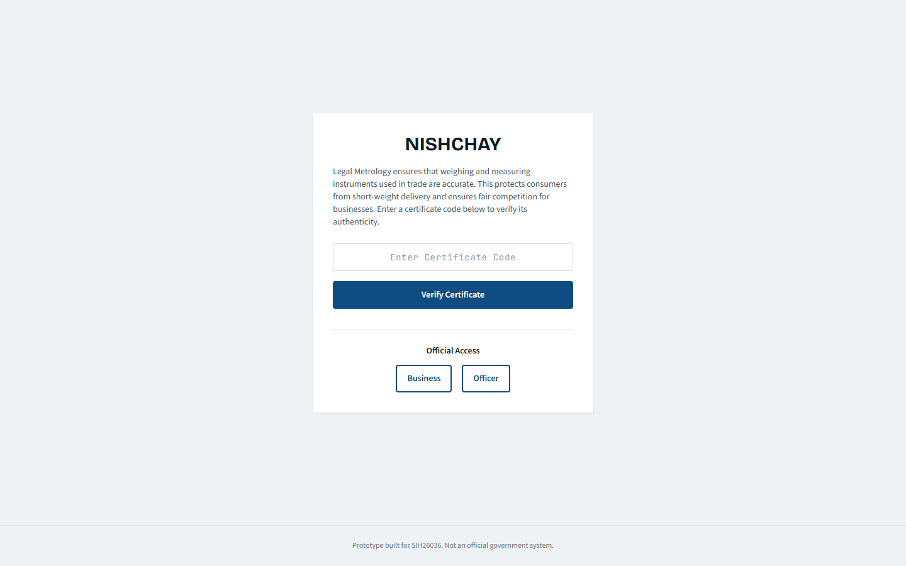
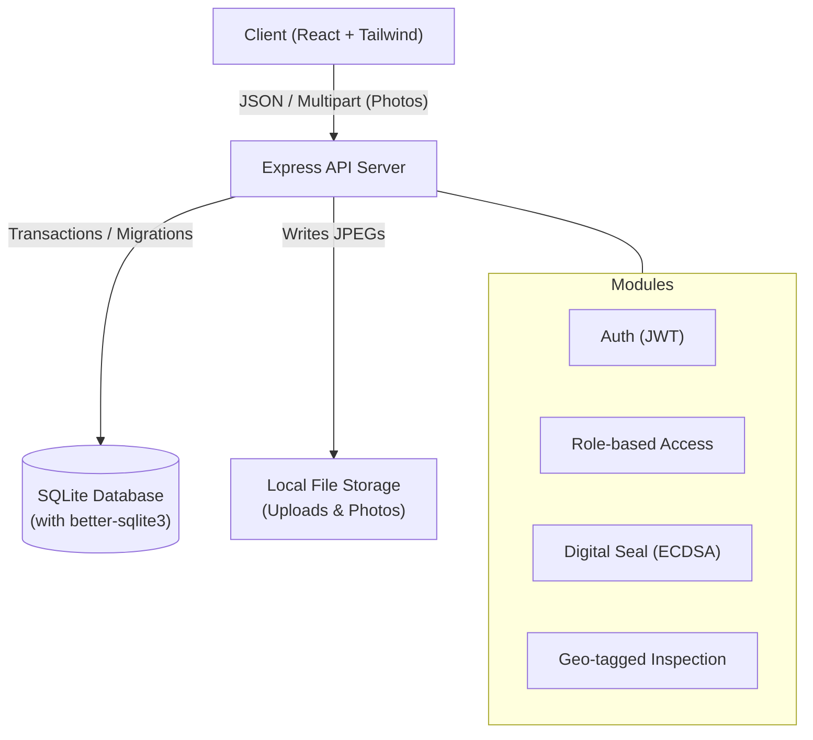

# Nishchay: Legal Metrology Transparency Platform

*One-line pitch*: A tamper-proof, geo-tagged certification and verification platform that brings radical transparency to legal metrology instruments.



## Problem Statement & Solution Mapping

Nishchay directly addresses the core requirements of SIH26036.

| Requirement | Module | Where to click |
| :--- | :--- | :--- |
| **Tamper-proof digital certificates** | Block 7 (Certificates) | Public QR Verification (`/verify/:id`) |
| **Geo-tagged field inspections** | Block 6b (Inspections) | LMO Dashboard > Start Inspection |
| **Online fee payments** | Block 5 (Payments) | Business Dashboard > Applications > Pay Fee |
| **Right-to-check / Consumer feedback** | Block 10 (Complaints) | Public QR Verify > "Report Issue" button |
| **Role-based access & automated routing** | Block 3 (Routing) | Admin Dashboard > Reassign Jobs |
| **Public Verification Portal** | Block 9 (Search) | Homepage > "Search Certificates" |

## Architecture Diagram



## Run Commands (Clean Room)

To run the platform locally from a fresh clone:

```bash
# 1. Install dependencies
npm ci

# 2. Seed database & create admin/demo accounts
npm run demo:setup

# 3. Start the server (runs on http://localhost:3000)
npm start
```

### Preflight Verification
To ensure all tests, linting, formatting, and builds are successful, run:
```bash
npm run preflight
```

## Demo Logins

The application starts with a set of seeded demo accounts.

| Role | Email | Password | Purpose |
| :--- | :--- | :--- | :--- |
| **Admin** | `admin1@nishchay.example` | `demo123` | Provision accounts, view system progress |
| **LMO** (Inspector) | `lmo1@nishchay.example` | `demo123` | View assigned jobs, perform inspections |
| **Business** | `biz1@nishchay.example` | `demo123` | Add instruments, apply for certification |

## What is Simulated / What is Not Built

Nishchay is a **Prototype built for SIH26036**. As per `PLAN.md`:

- **Real payments are simulated:** The payment gateway uses a mock "Pay with Dummy Gateway" flow instead of Razorpay/CCAvenue.
- **Physical OCR & AI is omitted:** Reading serial numbers off physical device images is omitted.
- **SMS/Email alerts are simulated:** The system records notifications in the DB but does not send actual emails or SMS.
- **Expiry Reminders:** Cron jobs for automated reminders are omitted.
- **Production File Storage:** Uses local disk (`/uploads`) instead of S3/GCS.
- **Hardware Security Module (HSM):** Digital signatures use a local private key file instead of an external HSM or KMS.
