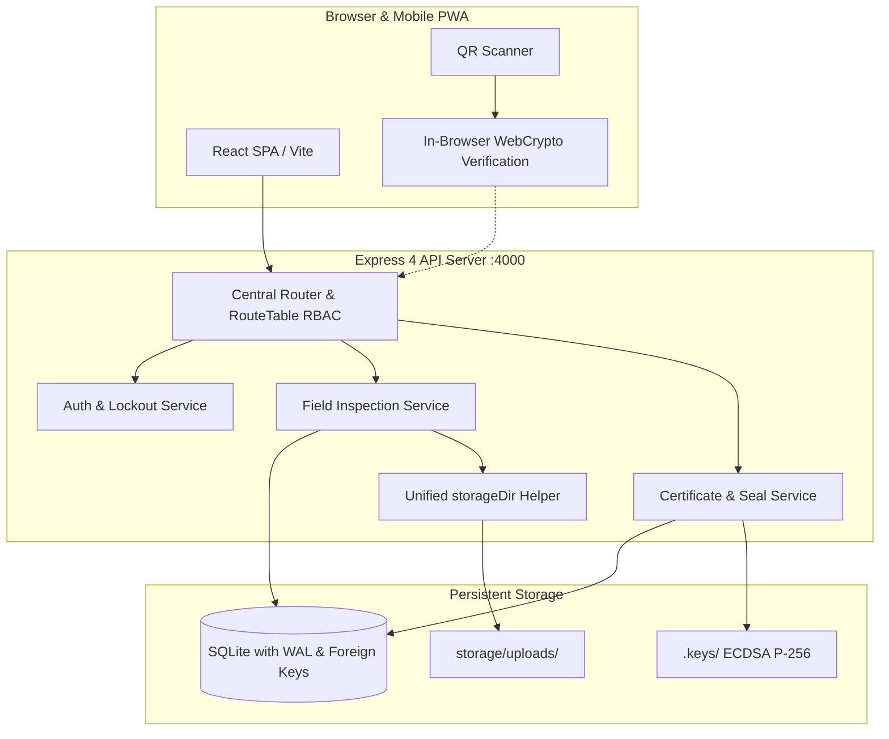
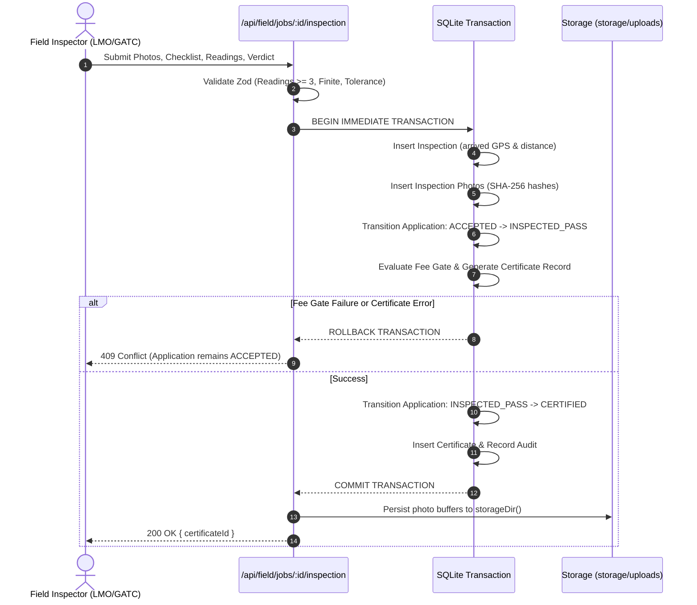

# Architecture & Technical Design

NISHCHAY is designed as a high-integrity verification and certification platform for Legal Metrology instruments under SIH26036. It utilizes a monolithic single-repo architecture (Node.js 22 LTS, Express 4, TypeScript, better-sqlite3, Vite, and React 18).



## Module-to-Code Map

| Module (Scope 6.1) | Backend Implementation | Frontend Implementation |
| :--- | :--- | :--- |
| **Auth & Registration (Mod 1)** | `server/auth/index.ts` | `web/src/pages/Register.tsx`, `web/src/pages/Login.tsx` |
| **Instrument Profiles (Mod 6)** | `server/api/instruments.ts`, `server/repositories/instrumentsRepo.ts` | `web/src/pages/Instruments.tsx` |
| **Verification Workflow (Mod 7)**| `server/api/applications.ts`, `shared/src/stateMachine.ts` | `web/src/pages/Applications.tsx`, `web/src/pages/ApplicationWizard.tsx` |
| **Fee Payment Gate (Mod 8)** | `server/services/paymentsService.ts`, `server/api/payments.ts` | `web/src/pages/SandboxCheckout.tsx`, `web/src/pages/ApplicationDetail.tsx` |
| **Field Verification (Mod 9)** | `server/api/field.ts`, `server/api/fieldInspection.ts` | `web/src/pages/field/JobDetail.tsx`, `web/src/pages/field/JobInspection.tsx` |
| **Certificate Engine (Mod 10)** | `server/services/certificateService.ts`, `server/services/certificatePdfService.ts` | `web/src/pages/BusinessDashboard.tsx`, `web/src/pages/CertificateSearch.tsx` |
| **QR Verification (Mod 11/12)** | `server/api/certificates.ts`, `server/seal/verifyFull.ts` | `web/src/pages/PublicVerify.tsx` |
| **Search & CSV Export (Mod 13/14)**| `server/repositories/certificatesQuery.ts`, `server/api/certificates.ts` | `web/src/pages/CertificateSearch.tsx` |
| **Role Dashboards (Mod 20)** | `server/api/dashboard.ts`, `server/api/profiles.ts` | `web/src/pages/BusinessDashboard.tsx`, `web/src/pages/OfficerDashboard.tsx`, `web/src/pages/AdminDashboard.tsx` |
| **Cryptographic Seal (Mod 21)** | `server/seal/index.ts`, `shared/src/canonicalJson.ts` | `shared/src/seal-browser.ts`, `web/src/pages/PublicVerify.tsx` |

---

## Unified Storage Architecture (`storageDir()`)

All binary files (supporting application documents, inspection evidence photos, and seal validation assets) are managed by a single centralized helper in `server/config/paths.ts`:

- Ingested inspection photos written via `server/api/fieldInspection.ts` and documents in `server/api/uploads.ts`.
- Verification re-hashing in `server/seal/verifyFull.ts`.
- Sample seed asset initialization in `server/scripts/seed.ts` and environment preflight in `server/scripts/preflight.ts`.

- **Path Resolution:** Checks `process.env.STORAGE_DIR`; if relative or unset, resolves to `<cwd>/storage/uploads`.
- **Automatic Directory Provisioning:** Creates `<cwd>/storage/uploads` recursively on server startup.
- **Path Parity:** `fieldInspection.ts` (ingestion), `uploadsService.ts` (application docs), `verifyFull.ts` (seal re-hashing), `seed.ts` (sample data), and `preflight.ts` (system checks) all consume `storageDir()`. This eliminates split-directory defects where photos written to one directory failed verification in another.

---

## Atomic Inspection and Certification Transaction

To prevent partial state corruption or orphaned inspections, field submission runs in a **single atomic database transaction**:



---

## Cryptographic Seal & Verification Data Flow

NISHCHAY's selective-disclosure cryptographic seal guarantees tamper-evidence while protecting private officer and business metadata:

### 1. Structure of the Seal
- **Public Record (Signed):**
  ```json
  {
    "v": 1,
    "certificateNo": "NSH-C-2026-000001",
    "instrumentId": "NSH-I-000001",
    "tradeName": "Ramesh Retailers",
    "instrumentClass": "W-1",
    "serialNo": "SN-98210",
    "validFrom": "2026-10-04T00:00:00.000Z",
    "validTo": "2027-10-04T00:00:00.000Z",
    "authorityName": "Legal Metrology Dept",
    "receiptDigest": "SHA-256(receipt_id:amount)",
    "detailsDigest": "SHA-256(canonicalJson(privateDetails))"
  }
  ```
- **Private Details (Encapsulated in `detailsDigest`, Never Made Public):**
  - Officer ID, GPS coordinates (`gpsLat`, `gpsLng`), arrival distance.
  - Raw test readings array (`[{ applied: 10, observed: 10 }, ...]`).
  - Completed checklist item status.
  - SHA-256 hashes of all on-site inspection photos.

### 2. Dual Verification Pipeline
1. **Server-Side Verification (`verifyFullSeal`):**
   - Re-computes SHA-256 hash of each photo file on disk via `storageDir()`.
   - Rebuilds `privateDetails` object from database and confirms `SHA-256(canonicalJson(privateDetails)) === publicRecord.detailsDigest`.
   - Verifies ECDSA P-256 signature using the system's public key.
   - Any modification to database records or disk photos produces `status: 'SEAL_BROKEN'`, `integrity: false`.
2. **Browser-Side Verification (WebCrypto):**
   - Fetches SPKI public key from `/api/public/keys`.
   - Client browser independently parses `publicRecord`, computes `canonicalJson`, and calls `crypto.subtle.verify` directly on the user's device, displaying "Verified in your browser".
